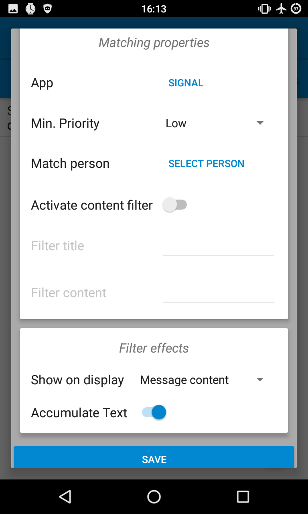

# Armband
*Armband* is an alternative Android app for the cheap "i5 plus" compatible China wristbands with a modern and clean GUI. 

## Features
* Connection to the device via Bluetooth
* Display basic information like firmware, battery life and hardware address
* Notification filter system for Android notifications, which can be forwarded to the wristband
* User-definable alarms engaging the vibration motor of the wristband
* Further custom device settings

## Screenshots

